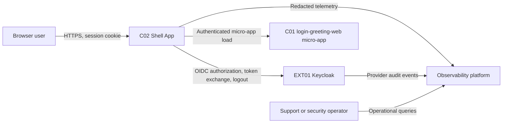
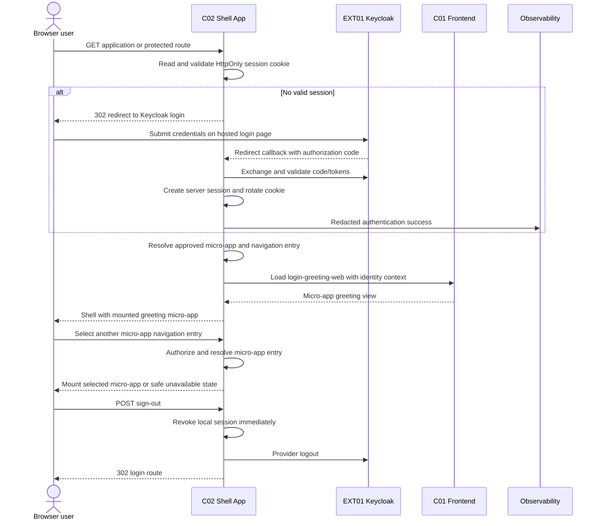

# Architecture Handoff: Login and User Greeting

**Feature**: `001-login-greeting`  
**Status**: Approved handoff
**Source specification**: [spec.md](spec.md)  
**Scope**: Full feature scope; browser, Shell App host, login-greeting micro-app, Keycloak, and observability

## Architecture Summary

Use Shell App as the browser's only application endpoint and authenticated micro-frontend host. Shell App owns the OIDC authorization-code flow, callback validation, server-side authenticated session, protected-route enforcement, sign-out, application navigation, micro-app registration, and micro-app loading. It redirects unauthenticated browsers to Keycloak's hosted login page and mounts only approved micro-apps after authentication. `login-greeting-web` is the first micro-app and owns greeting presentation only. Keycloak remains authoritative for credentials, user identity, and provider session policy.

The BFF maintains the application session using a Secure, HttpOnly, SameSite-appropriate cookie containing an opaque session reference. Session data is held in a server-side session store owned by the BFF deployment boundary. The Shell App is implemented with Angular SSR so the authenticated shell can be server-rendered and hydrated without moving session authority into the browser. `login-greeting-web` is an Angular standalone micro-app mounted through the Shell App lifecycle contract. Tokens and OIDC responses remain server-side. The greeting flow is synchronous; telemetry is asynchronous and never participates in an access decision.

## Personas and Journeys

| Persona | Need or goal | Supported journeys | Authorization context |
|---------|--------------|---------------------|-----------------------|
| Registered user | Sign in and see a private greeting | US1, US3 | Valid BFF session; no role beyond authenticated user |
| Unauthenticated visitor | Attempt sign-in safely and recover from failure | US2 | Public login entry; no protected upstream access |
| Support or security operator | Understand outcomes without secret disclosure | US2, US3 | Operational access to redacted telemetry |

## Business Capabilities

| Capability | Outcome | Owning component |
|------------|---------|------------------|
| User Authentication | Valid credentials produce a validated identity and BFF session | C02, using EXT01 |
| Authenticated Access Control | Only a valid server session reaches protected routes and the frontend | C02 |
| Personalized User Presentation | The frontend displays the BFF-provided username as escaped text | C01 |
| Application Shell and Navigation | Authenticated users see a consistent shell and can navigate to approved micro-apps | C02 |
| Micro-App Composition | Approved micro-apps are loaded inside the authenticated shell with isolated contracts | C02; C01 for greeting presentation |
| Authentication Auditability | Outcomes and dependency failures are observable without secrets | C02; EXT01 for provider events |

## System Context

The browser never calls Keycloak directly for application authentication callbacks and never loads a micro-app outside Shell App. Shell App is the application trust boundary, deployment entry point, navigation owner, and micro-app host.

## Component Catalog

| ID | Type | Name | Purpose | Owned capability/data | Responsibilities | Explicit non-responsibilities |
|----|------|------|---------|-----------------------|------------------|-------------------------------|
| C01 | Frontend micro-app | login-greeting-web | Render the protected greeting inside Shell App | Greeting presentation and transient view state | Display the trusted username as text, request sign-out through Shell App, show safe micro-app errors | OIDC, credential collection, session storage, application navigation, shell layout, route protection, token handling, user accounts |
| C02 | Shell App host and backend service | Shell App | Provide the browser entry point, authenticate through Keycloak, maintain sessions, host navigation, and load approved micro-apps | Authenticated Session, session reference, navigation/manifest policy, OIDC transaction state, redacted application telemetry | Redirect to Keycloak, validate callback, create/destroy server session, guard routes, render shell/navigation, resolve and load micro-apps, fail closed, emit telemetry | Credential verification, authoritative identity lifecycle, micro-app business presentation, password recovery, roles beyond authenticated access |
| EXT01 | External identity provider | Keycloak | Authenticate users and manage provider identity/session policy | User Account, credentials, provider session, tokens, provider audit records | Verify credentials, issue/revoke OIDC artifacts, apply configured defaults | BFF session ownership, gateway routing, greeting content, application telemetry |

Detailed specifications: [components/login-greeting-web.md](components/login-greeting-web.md), [components/shell-app.md](components/shell-app.md), and [components/keycloak.md](components/keycloak.md). Implementation handoffs: [component-plans/login-greeting-web/plan.md](component-plans/login-greeting-web/plan.md), [component-plans/shell-app/plan.md](component-plans/shell-app/plan.md), and [component-plans/keycloak/plan.md](component-plans/keycloak/plan.md).

## Bounded Contexts and Ownership

| Context | Components | Decisions owned | Data owned | Invariants |
|---------|------------|-----------------|------------|------------|
| Application Shell, Navigation, and Session | C02 | OIDC transaction validation, session lifecycle, route policy, navigation policy, micro-app loading, error mapping | Server-side Authenticated Session, opaque browser session reference, approved micro-app manifest/registry, transient OIDC transaction, redacted application events | No micro-app loads without a valid session and approved manifest entry; invalid or expired sessions fail closed |
| Greeting Micro-App Experience | C01 | Greeting rendering and micro-app view behavior | Transient greeting view model | Username is rendered as text; C01 never treats client state as authentication proof or owns navigation |
| Identity and Access | EXT01 | Credential verification, identity, provider session/token lifecycle, provider abuse policy | User Accounts, credentials, provider sessions/tokens, provider audit records | Credentials are verified only by Keycloak; provider defaults govern lifecycle |

Every persistent data set has one owner. C02 owns the application session store; Keycloak owns provider identity and sessions; C01 owns no persistent data. Session consistency is immediate within one BFF request path; provider expiration/revocation is observed when C02 validates or refreshes the provider session. No distributed transaction is used.

## Interaction Model

| Interaction | Sender | Receiver | Purpose | Contract | Mode | Failure, retry, and idempotency |
|-------------|--------|----------|---------|----------|------|---------------------------------|
| I01 Browser application request | Browser | C02 | Enter application and request protected content | [contracts/browser-backend-gateway.md](contracts/browser-backend-gateway.md) | Synchronous | Missing/invalid session redirects to Keycloak or login; no retry that bypasses the guard |
| I02 OIDC authentication | C02 | EXT01 | Authenticate and validate identity | [contracts/keycloak-oidc.md](contracts/keycloak-oidc.md) | Synchronous user flow | No credential retry; bounded provider timeout; any validation failure creates no session |
| I03 Micro-app loading and identity context | C02 | C01 | Mount the approved greeting micro-app inside Shell App | [contracts/backend-frontend-gateway.md](contracts/backend-frontend-gateway.md) | Synchronous or manifest-driven load | Unavailable/malformed micro-app fails isolated; shell remains usable; no unauthenticated fallback |
| I04 Micro-app navigation | Browser | C02 | Navigate among approved current and future micro-apps | [contracts/micro-app-navigation.md](contracts/micro-app-navigation.md) | Synchronous route selection with bounded micro-app load | Unknown/unauthorized entry is denied; load failure shows safe state without invalidating the session |
| I05 Sign-out | Browser | C02, then C02 to EXT01 | End local and provider sessions | [contracts/browser-backend-gateway.md](contracts/browser-backend-gateway.md), [contracts/keycloak-oidc.md](contracts/keycloak-oidc.md) | Synchronous command | Local invalidation is immediate; provider logout is idempotent and failure cannot restore access |
| I06 Security telemetry | C02 | Observability platform | Record redacted outcomes and dependency failures | [contracts/security-telemetry.md](contracts/security-telemetry.md) | Asynchronous/buffered | Delivery failure cannot change authorization; bounded buffering/drop metrics are allowed |
| I07 Provider audit telemetry | EXT01 | Observability platform | Export provider-owned events | Provider-native export; no application contract | Asynchronous | Provider policy governs retry and retention |

## Cross-Cutting Design

### Security and Trust Boundaries

- Browser-to-C02 uses HTTPS. The session cookie is Secure, HttpOnly, scoped to the application host, and SameSite-compatible with the callback flow; state-changing requests require CSRF protection.
- C02 is the only component exposed as the application origin and the only owner of navigation. The browser cannot supply authentication claims to C01; C02 injects a server-derived identity context over a private or authenticated micro-app boundary.
- C02 uses a maintained server-side OIDC library to validate issuer, client binding, redirect URI, state, nonce, PKCE, signature, expiry, and token exchange results. Passwords are entered only on Keycloak's hosted page.
- Session fixation is prevented by rotating the session identifier after authentication. Logout deletes the local session before provider logout. All protected failures deny access.
- C01 uses context-safe text rendering. Logs, traces, cookies, URLs, and telemetry exclude passwords, tokens, authorization codes, raw provider responses, and session contents. Micro-app manifests and entry URLs are validated against an allow-list; arbitrary browser-provided module URLs are never loaded.

### Observability

C02 emits versioned redacted events for login start/result, callback validation failure, session creation/validation failure, route denial, micro-app navigation/load failure, logout, and rate limiting. Metrics cover authentication outcomes, session-store errors, shell latency, protected denials, micro-app manifest/load success and failure, Keycloak dependency latency, and logout outcomes. Correlation IDs span browser request, C02, Keycloak, and C01 without sensitive values. Alerts distinguish invalid credentials, provider outage, session-store outage, and micro-app failure.

### Reliability and Operations

Use bounded timeouts for Keycloak, the session store, and each micro-app load. Do not retry credential submissions. At most one bounded retry may be used for a transient session-store read, provider metadata read, or manifest fetch, with no authorization bypass. Shell failures fail closed for protected routes; an individual micro-app failure is isolated to its mount. Session-store loss denies access rather than reconstructing sessions from browser data. Deploy C02/Shell App and C01 as independently replaceable units; Keycloak configuration is coordinated external configuration.

### Compatibility and Evolution

The browser-backend contract is versioned and same-origin by default. Shell App-to-C01 loading uses a versioned internal contract and strips inbound spoofable identity headers before injecting trusted context. OIDC discovery is issuer-based, and changing claim mapping, cookie policy, session schema, or trusted identity headers requires coordinated rollout. Session schema changes require a compatible read/dual-write or a planned session invalidation.

## Architecture Decisions and Trade-offs

| Decision | Rationale | Alternatives considered | Consequences |
|----------|-----------|-------------------------|--------------|
| Make C02 the browser's only application endpoint | Centralizes authentication and prevents browser token/session handling | Browser OIDC client; separate auth proxy | Adds a service and session-store dependency, but materially reduces browser exposure |
| Keep the authenticated session server-side | User explicitly requires backend-maintained sessions; opaque cookie limits credential/token exposure | JWT in browser; local browser state | Requires session-store availability and scaling strategy |
| Make C02 the micro-app host and navigation owner | Gives users one authenticated shell and creates a controlled extension point for future micro-apps | Independent browser-loaded micro-frontends; direct app-to-app navigation | Requires manifest/version governance and isolates load failures |
| Load C01 as the first micro-app | Keeps greeting presentation independent while centralizing session and navigation policy | Put greeting UI directly in the shell | Requires a micro-app contract and adds a mount boundary |
| Use Angular SSR for C02 and Angular standalone APIs for C01 | Provides server-rendered shell output, hydration, and one Angular component model across the host and micro-app while retaining the server-side session boundary | Separate frontend framework; client-only shell; custom micro-app runtime | Requires SSR/hydration testing and a small host adapter for the C01 lifecycle |
| Keep Keycloak as credential authority | Preserves OIDC boundary and avoids password handling in C02 | Local credential store; password proxy | Keycloak remains a critical dependency and hosted login is provider-owned |
| Keep telemetry asynchronous | Observability must not block or decide access | Synchronous audit transaction | Events can be delayed or dropped, so sink health is monitored |

## Traceability

| Requirement or journey | Persona | Capability | Component(s) | Contract or flow |
|------------------------|---------|------------|-------------|------------------|
| FR-001, FR-002 / US1, US2 | Registered user; visitor | User Authentication | C02, EXT01 | I01, I02, UI contract |
| FR-003, FR-004, FR-014, FR-015 / US1 | Registered user | User Authentication | C02, EXT01 | I02, OIDC contract |
| FR-005, FR-006, FR-011 / US1 | Registered user | Personalized User Presentation | C02, C01 | I03, frontend contract |
| FR-007 / US1, US3 | Registered user | Authenticated Access Control | C02 | I01, I03 |
| FR-008, FR-009 / US2 | Visitor | User Authentication | C02, EXT01 | I01, I02 |
| FR-010 / US3 | Registered user | Authenticated Access Control | C02 | I04 |
| FR-012, FR-013 / US2, US3 | Support or security operator | Authentication Auditability | C02, EXT01 | I05, I06 |
| SC-001 to SC-005 | All personas | All capabilities | C01, C02, EXT01 | I01-I06 and component criteria |

## Deployment Constraints and Risks

- Keycloak uses a confidential authorization-code client with PKCE, issuer discovery, exact redirect/logout URIs, and the `preferred_username` claim. Provider defaults govern session expiration and logout.
- C02 uses shared TLS-enabled Redis for sessions and OIDC transactions; C02 scales horizontally and fails closed on Redis loss. No affinity-only fallback is permitted.
- C01 runs as a private micro-app entry and accepts only authenticated Shell App traffic using the versioned `BFF-UI-001` projection. Direct browser access is denied.
- Username projections are limited to 128 Unicode characters; return paths are same-origin paths beginning with `/`; state-changing browser requests use CSRF protection.
- The supported browser baseline is current Chrome, Edge, Firefox, and Safari on desktop and mobile. Keycloak/edge policy owns distributed failed-login throttling; the observability platform owns telemetry retention.
- Keycloak, Redis, and C01 remain independent availability risks. Alerts must distinguish provider, session-store, and micro-app load failures; recovery cannot reconstruct access from browser data.
